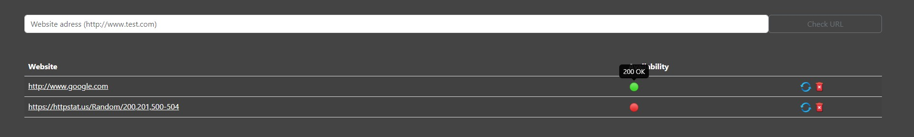
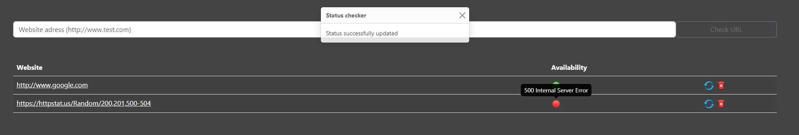

# golang-status-checker-website
Checks the http response of any website

How it works:
The application receive a website URL (http://www....com) and return the http status response of this request.

If the icon is green, it means the response has the code less than 400. If it is red, the code is more 400 or more.

Examples of the application running:

Status 200 OK:

Status 500 Internal Server Error:
